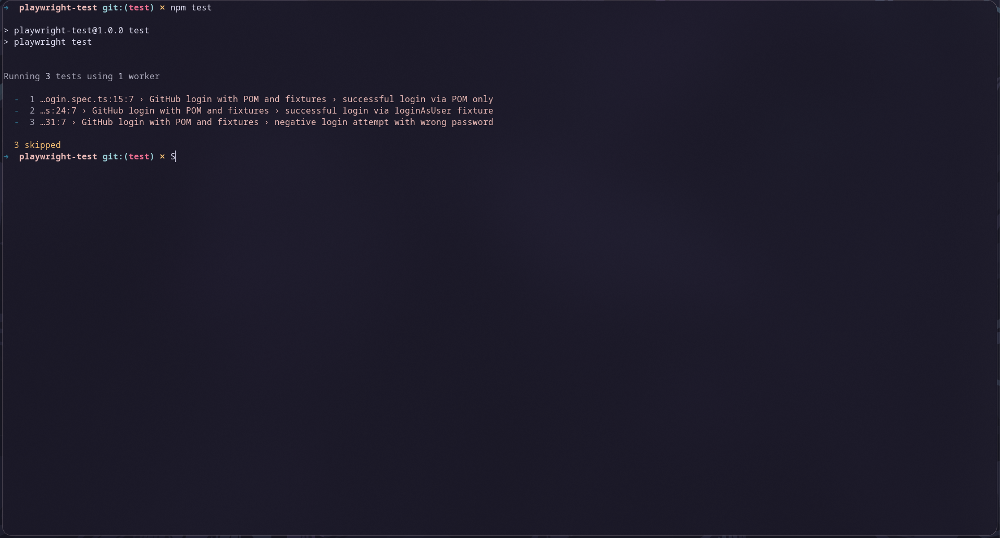

## Prerequisites

- Node.js 18+
- `npm install` executed in the repo root
- `npx playwright install` 
## Setup & Credentials

1. Install dependencies:
   ```bash
   npm install
   npx playwright install
   ```
2. Provide GitHub credentials for the tests:
     ```bash
     export GITHUB_USERNAME="real.username"
     export GITHUB_PASSWORD="real.password"
     ```

## Running

- Standard run (uses credentials stored in `auth/credentials.ts`):
  ```bash
  npm test
  ```




